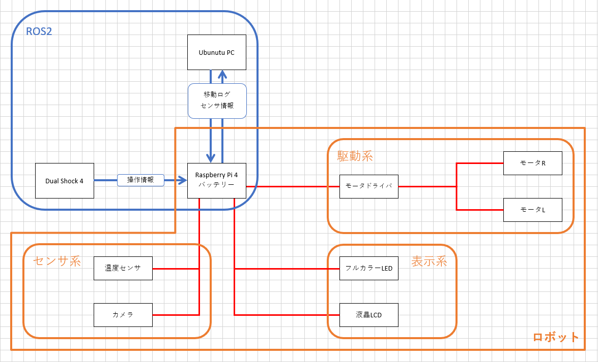
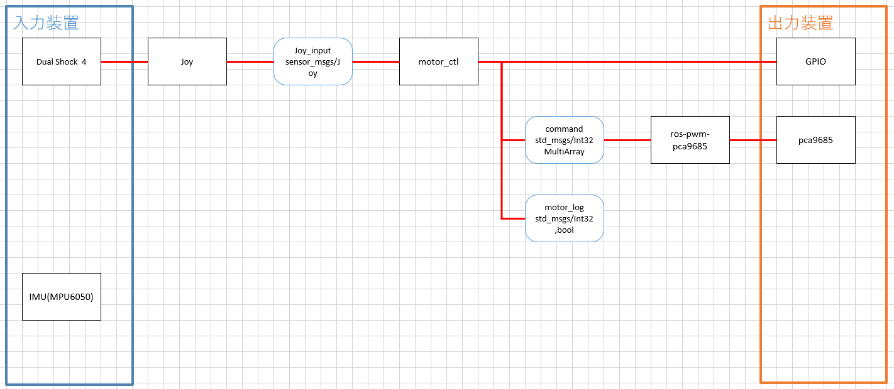
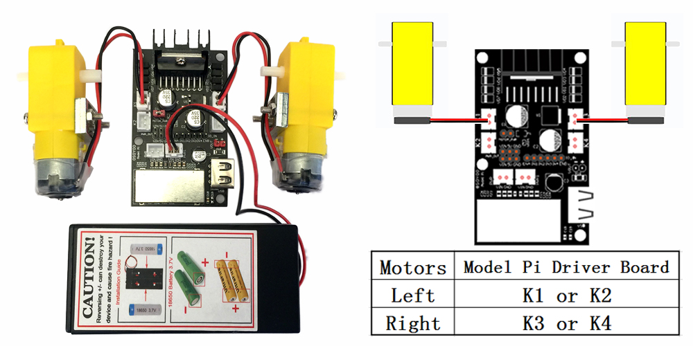
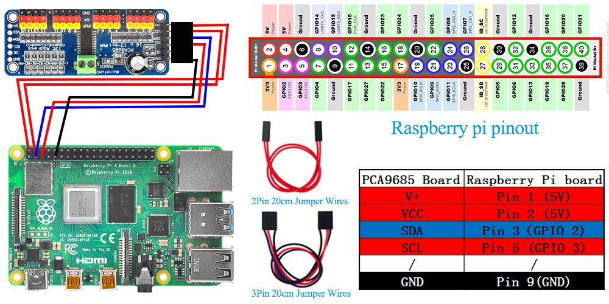
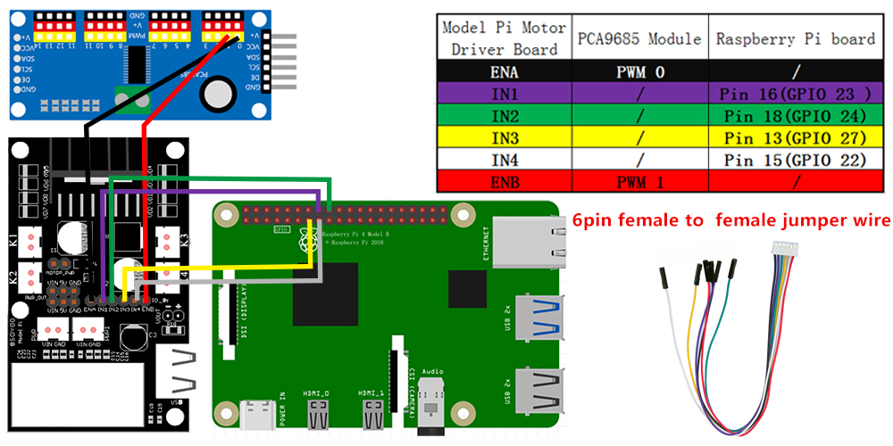

# ROS1ラジコン
## 目的
自己研鑽．
会社でのミニバラック計画の予習兼ロボット製作の感覚取り戻し．

## 目標
- ros1の基礎の復習
- ソフトウェア面の技術のアップデート
- ミニバラック計画の予習

## これまでの動き
- 0723
    - 上司へ計画を相談→購入ロボット決定(後述)(~0808)
- 0811
    - DS4のBluetooth接続
    - ROSノード構造の決定
- 0812
    - PCA9685の動作概要把握
    - ros-pwm-pca9685の概要把握
- 0813
    - DS4のBluetooth接続
    - 本体のラジコン操作
## 次の動き
- 0808
    - お盆休み中にDS4で動くラジコンを完成させる(詳細は後日整理)
    - ~~DS4のBluetooth接続~~ (0809done)
    - ~~ROSノード構造の決定~~ (0809done)
- 0809
    - ~~PCとラズパイ3のROS連携(0812)~~ (0812done)
    - PCA9685のROSでの制御(0812)
        - ~~ros-pwm-pca9685の概要理解~~ done
        - ~~ros-pwm-pca9685に合わせてarrayをpub(詳細は後述)~~
        - ~~gpioを制御~~
        - ~~モータの制御履歴(回転方向(bool?)，回転速度(int64?))をpub~~
    - joy情報をmotor_ctlに渡す(0813)
        - ~~joy情報のsub~~
        - ~~joy情報からモータ回転方向，回転速度を計算~~
        - ~~publisherへ受け渡し~~
    - ~~コントローラの割り当て検討(0813)~~
    - ~~動作確認(0814)~~
    - ~~細かいデバッグ(0815)~~
- 0815
    - ライントレースの実装
    - サーボモータの制御
## 仕様
### 全体仕様
基本的にはROS2ロボットと同じ  

### 車体情報
https://osoyoo.com/2020/08/01/osoyoo-raspberry-pi-v2-0-car-introduction/
### ROSノード構造

## 各系統について
### ROS1
- パッケージの作成
- pub-sub通信の理解

公式チュートリアルを参考にする．  
http://wiki.ros.org/ROS/Tutorials
### DualShock4-RaspberryPi3通信
https://qiita.com/Yuya-Shimizu/items/4bed435e65cefc6d2df1
使用ライブラリ
- ds4drv(ds4用のドライバ) done
- joy(ROS) done
- BlueZ(Bluetooth) doing

### raspi3-PC通信
参考ページ  
https://qiita.com/srs/items/7d4aeb5e44138f97c770
https://qiita.com/srs/items/309a16ae331da563c2e3  

pc側は通常通りの運用でOK．ラズパイは.bashrcに設定を書き込み済み．  
pcでのroscore起動を忘れないこと．

### PCA9685制御
#### モータドライバ情報
PCA9685.pdf  
#### 配線

#### 使用ライブラリ
https://github.com/dheera/ros-pwm-pca9685
https://www.sato-susumu.com/entry/pwm_pca9685

<b>モータ回転方向→gpioのON/OFFで制御</b>
right
| 22 | 27 | 挙動 |
|----|----|----|
| 0 | 0 ||
| 1 | 0 |正転|
| 0 | 1 |逆転|
| 1 | 1 |ブレーキ|

left
| 24 | 23 | 挙動 |
|----|----|----|
| 0 | 0 ||
| 1 | 0 |正転|
| 0 | 1 |逆転|
| 1 | 1 |ブレーキ|

<b>モータ回転速度→pwmで制御</b>
>/command std_msgs/Int32MultiArray -1 '{data:[left, right, -1, -1, -1, -1, -1, -1, -1, -1, -1, -1, -1, -1, -1, -1]}'

rightもしくはleftを0~65535で設定し，pubすることで0%~100%の出力となる．  
-1で更新なしとなる．

rosノードのsudo権限について  
https://akeblo.blogspot.com/2017/09/rosnoderoot.html
### ロボット全体

#### GPIO制御

### 表示系
#### フルカラーLED
使用LED
https://akizukidenshi.com/catalog/g/gI-02476/  
参考URL
https://www.souichi.club/raspberrypi/color-led/
